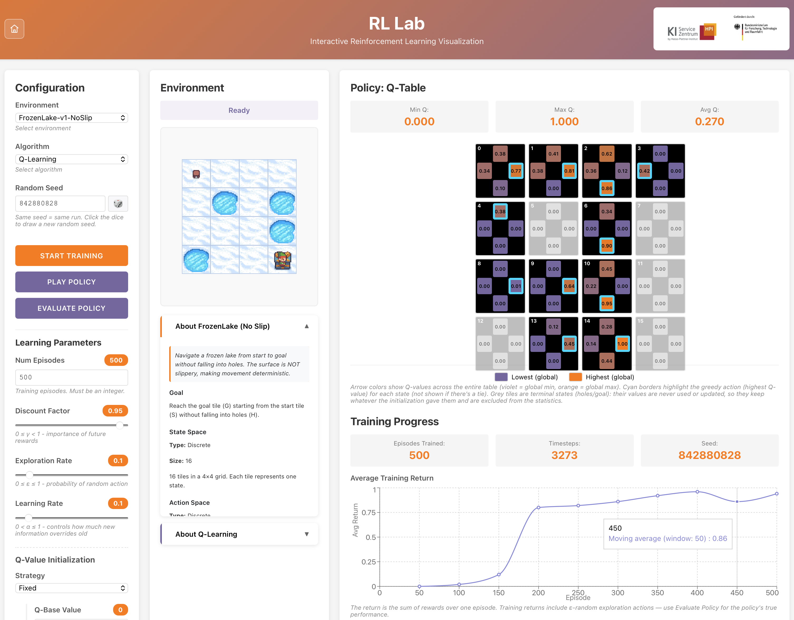
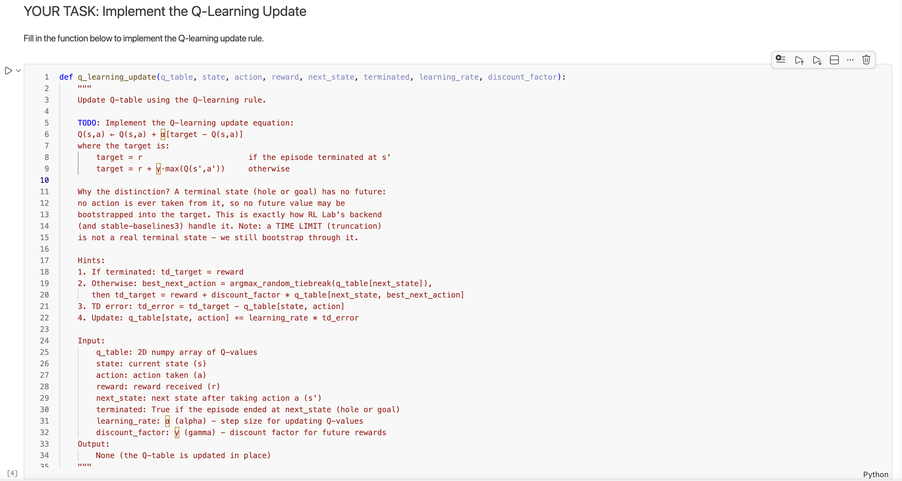

<div style="background-color: #ffffff; color: #000000; padding: 10px;">

<h1> Workshop: Reinforcement Learning I - Introduction
</div>

This repository contains the material used in the "Reinforcement Learning I - Introduction" workshop by the AI Service Center Berlin Brandenburg. It provides an educational interface, called **RL Lab**, for building intuition about reinforcement learning fundamentals. The backend is built on the environments of the [gymnasium library](https://gymnasium.farama.org).



## Features

- **Environments**:
   - [Gymnasium FrozenLake-v1](https://gymnasium.farama.org/environments/toy_text/frozen_lake/) (4x4) with `is_slippery=False` (deterministic) and `is_slippery=True` (stochastic)
   - [Gymnasium CartPole-v1](https://gymnasium.farama.org/environments/classic_control/cart_pole/)
   - [Gymnasium MountainCar-v0](https://gymnasium.farama.org/environments/classic_control/mountain_car/)
- **Algorithms**:
   - Q-Learning (custom build) — FrozenLake (tabular; discrete states only)
   - DQN ([stable-baselines3](https://stable-baselines3.readthedocs.io/)) — all four environments; on FrozenLake the network's Q-values are rendered as the familiar Q-table
   - PPO ([stable-baselines3](https://stable-baselines3.readthedocs.io/)) — CartPole, plus MountainCar as a deliberate failure demo (on-policy learning starves on sparse rewards)
- **Workshop features**: live training charts, greedy policy playback with action overlay, 100-episode policy evaluation with confidence interval, sticky seeds for reproducible runs, per-environment tuned defaults, optimistic/pessimistic value initialization (DQN) to explore the exploration-exploitation tradeoff

## Setup and Installation

### Prerequisites

- Git
- Docker Desktop running or Docker Engine

### Quick Start (Experienced Users)

Already have git and Docker installed? Get started in 4 commands:

1. Clone the repository
```bash
git clone https://github.com/aihpi/workshop-rl1-introduction.git
```

2. Navigate inside
```bash
cd workshop-rl1-introduction
```

3. Is Docker running? Then pull the latest images and start the app (detached mode)
```bash
docker compose pull
docker compose up -d
```
(`docker compose pull` matters especially if you have run RL Lab before: `up` alone keeps using old images.)

4. Open browser to http://localhost:3030

**First-time setup takes ~1-2 minutes** (downloads pre-built images).

**Note**: Running in detached mode (`-d`) keeps your terminal free. To view logs if needed for debugging, open a separate terminal and run `docker compose logs -f`

### Installation Guides (Beginners)

**New to programming or Docker?** Follow the installation guides:

<table>
<tr>
<td align="center" width="33%">
<h3>📱 Windows</h3>
<p><strong><a href="docs/INSTALLATION_WINDOWS.md">Windows Installation Guide</a></strong></p>
</td>
<td align="center" width="33%">
<h3>🍎 macOS</h3>
<p><strong><a href="docs/INSTALLATION_MACOS.md">macOS Installation Guide</a></strong></p>
</td>
<td align="center" width="33%">
<h3>🐧 Linux</h3>
<p><strong><a href="docs/INSTALLATION_LINUX.md">Linux Installation Guide</a></strong></p>
</td>
</tr>
</table>

**Useful Docker Commands**

Once installed, here are some helpful commands:

```bash
docker compose pull            # Update to the latest images
docker compose up -d           # Start the application (detached mode)
docker compose down            # Stop the application
docker compose logs -f         # View live logs (for debugging, in separate terminal)
docker compose logs backend    # View only backend logs
docker compose logs frontend   # View only frontend logs
docker compose ps              # Check container status
docker compose restart         # Restart services
```

## User Guide

### Using the Tool

1. **Open the application** in your browser at http://localhost:3030

2. **Pick an environment and an algorithm** — the algorithm list only offers compatible choices. Info panels explain both.

3. **Adjust parameters** using the sliders (the set depends on the algorithm), e.g.:
   - **Training budget**: episodes (Q-Learning) or timesteps (DQN/PPO)
   - **Learning Rate (α)**: How fast the agent learns
   - **Discount Factor (γ)**: Importance of future rewards
   - **Exploration (ε)**: fixed rate (Q-Learning) or decay schedule (DQN)
   - **Seed**: every run is reproducible; the dice draws a new one

4. **Start training**: Click "Start Training" and watch real-time visualizations:
   - **Environment viewer**: Renders the end of training episodes as they happen
   - **Training progress**: return, episode length and exploration charts
   - **Policy: Q-Table**: the learned action values on FrozenLake (Q-Learning's table, or the DQN network read out state by state)

5. **Play policy**: Click "Play Policy" to watch the greedy policy step-by-step, with the chosen action overlaid. This also works *before* training — useful to show what a random/untrained policy does.

6. **Evaluate policy**: Runs 100 greedy episodes and reports the mean return with a 95% confidence interval, against the environment's "solved" threshold.

### Finished early? Want to dig deeper at home?

RL Lab shows *what* the algorithms do — two small Jupyter notebooks in [`examples/`](examples/README.md) show the code that does it. They are deliberately minimal (a guided tour with exercises, not a course) and link to the official [Gymnasium](https://gymnasium.farama.org) and [Stable-Baselines3](https://stable-baselines3.readthedocs.io/) documentation wherever you want more depth:

- **`frozenlake_q_learning.ipynb`** — implement the Q-learning update rule yourself (the exact rule RL Lab's tabular agent uses, terminal-state handling included), train it on an 8×8 map and watch your own agent play.
- **`sb3_quickstart.ipynb`** — the ~15 lines of Stable-Baselines3 code behind RL Lab's DQN and PPO: the evaluate → train → evaluate workflow with the same tuned hyperparameters, plus two exercises (why MountainCar needs its own settings; swapping DQN for PPO). Its first cell installs the bigger deep-RL dependencies itself.

Solutions are included. One-time setup (~2 minutes, then everything is click-through): [`examples/README.md`](examples/README.md).



## Repository Structure

```
workshop-rl1-introduction/
├── backend/               # Python Flask backend
│   ├── algorithms/        # RL algorithm implementations
│   │   ├── base_algorithm.py      # Abstract base class
│   │   ├── q_learning.py          # Q-Learning (custom, tabular)
│   │   ├── sb3_base.py            # Shared stable-baselines3 wrapper
│   │   ├── dqn.py                 # DQN (stable-baselines3)
│   │   └── ppo.py                 # PPO (stable-baselines3)
│   ├── environments/      # Gymnasium environment handling
│   ├── training/          # Session management
│   ├── tests/             # Backend test suite
│   └── app.py             # Flask API server
├── frontend/              # React frontend
│   ├── src/
│   │   ├── components/    # React components (parameters, viewer, charts,
│   │   │                  # info panels, Q-table & evaluation visualizations)
│   │   ├── content/       # Environment & algorithm texts (About panels)
│   │   ├── App.js         # Main application
│   │   └── api.js         # Backend communication
│   └── src/components/__tests__/  # Frontend test suite
├── examples/              # Optional homework notebooks (+ solutions)
│   ├── notebooks/
│   │   ├── frozenlake_q_learning.ipynb   # Implement Q-Learning yourself
│   │   ├── sb3_quickstart.ipynb          # DQN/PPO with stable-baselines3
│   │   └── solutions/
│   └── README.md          # Notebook setup instructions
├── docs/
│   ├── DEVELOPMENT.md          # Maintainer setup (dev mode, local runs)
│   ├── INSTALLATION_LINUX.md   # Linux installation guide
│   ├── INSTALLATION_MACOS.md   # macOS installation guide
│   ├── INSTALLATION_WINDOWS.md # Windows installation guide
│   └── screenshots/            # Documentation screenshots
├── presentations/         # Workshop slides
├── docker-compose.yml     # Participant setup (self-contained images)
└── docker-compose.dev.yml # Maintainer override (bind mounts, hot reload)
```

## References

- [Gymnasium Library Documentation](https://gymnasium.farama.org)
- [Stable-Baselines3 Documentation](https://stable-baselines3.readthedocs.io/)
- Environments: [FrozenLake](https://gymnasium.farama.org/environments/toy_text/frozen_lake/) · [CartPole](https://gymnasium.farama.org/environments/classic_control/cart_pole/) · [MountainCar](https://gymnasium.farama.org/environments/classic_control/mountain_car/)

## Author

- [David Goll](https://github.com/golldavid)
- [Jill Barvencik](https://github.com/Jill-Barvencik)

## License

MIT License - Free to use for educational purposes

---

## Acknowledgements


The [AI Service Centre Berlin Brandenburg](http://hpi.de/kisz) is funded by the [Federal Ministry of Research, Technology and Space](https://www.bmbf.de/) under the funding code 01IS22092.
